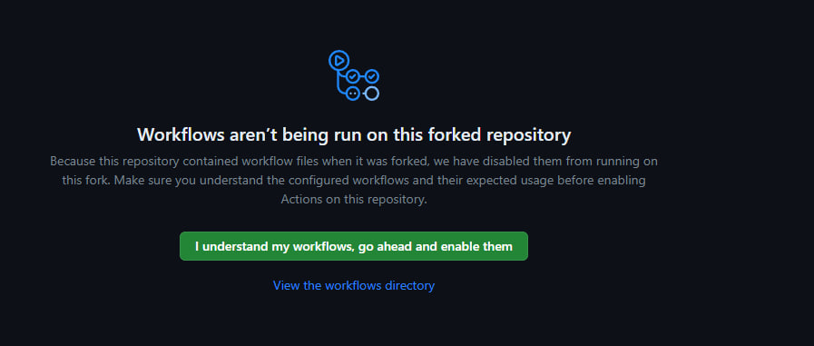

# Создание приложения, проверяющего возможность прохождения последовательности клеток на шахматной доске ходом коня
## Назначение
Репозиторий содержит заготовку приложения для прохождения тестового задания Зимней JAVA школы КРОК. Обучающиеся клонируют репозиторий к себе и выполняют тестовые задания. Тестовое задание принимается на рассмотрение проверяющим только в случае, если код собирается и успешно проходят все тесты.

## Структура проекта
Проект создан по типовой структуре для сборки Apache Maven. Это позволяет организовать автоматизированную сборку приложения с загрузкой необходимых дополнительных библиотек и выполнением проверок корректности реализации им поставленной задачи. Более подробно про Apache Maven можно прочитать [здесь](https://maven.apache.org) (его изучение не входит в программу курса).

| Каталог/файл | Назначение |
| ----- | ----- |
| src/main/java | Каталог, содержащий исходный текст программы. |
| src/test/java | Каталог, содержащий тесты программы (написаны с использованием фреймворка [JUnit 5](https://junit.org/junit5/)). |
| target | Каталог, куда производится сборка приложения |
| pom.xml | Файл с описанием сборки приложения. |

## Описание классов
Все классы находятся в пакете **croc.education.ws2023spb.knightsmove**.

| Краткое наименование класса/интерфейса | Описание |
|------|------|
| ChessPosition | Интерфейс задания расположения фигуры на традиционной шахматной доске 8x8. <br/><br/> Создаваемый по условию задачи класс, описывающий позицию на шахматной доске 8x8 должен его реализовывать. |
| ChessPositionParser | Класс, содержащий методы преобразования в объект расположения фигуры на шахматной доске из различных форматов. <br/><br/> Метод **parse** класса представляет собой заглушку. Его следует реализовать. Корректность реализации метода контролируется тестами **TestChessPositionParser**. |
| IllegalMoveException | Исключение, выбрасываемое в случае, если при перемещении шахматного коня из текущей клетки в следующую происходит с нарушением правил. <br/><br/> Представляет собой заглушку, следует реализовать наполнение. Ожидается, что в сообщении исключения будет выводится информация о неверном ходе. Это проверяется в тесте **TestKnightsMoveChecker.checkWrongMove()**. |
| KnightsMoveChecker | Интерфейс обработчика, проверяющего, что последовательность клеток на шахматной доске может быть пройдена ходом коня. |
| KnightsMoveCheckerFactory | Класс, реализующий фабричный метод, возвращающий обработчики, проверяющие, что последовательность клеток на шахматной доске может быть пройдена ходом коня. <br/><br/> Метод **get** класса представляет собой заглушку. Его следует реализовать, используя **ChessPositionParser**. Корректность реализации метода контролируется тестами **TestKnightsMoveChecker**. |
| Application | Основной класс приложения. <br/><br/> Метод **main** класса представляет собой заглушку. Его следует реализовать согласно постановки, используя **KnightsMoveCheckerFactory**. Корректность реализации метода контролируется тестами **TestApplication**. |

## Настройка окружения
Для настройки окружения следует выполнить следующие шаги:
1. Установить дистрибутив Java 17 так, чтобы он запускался по умолчанию. Запуск команды ``` java -version ``` должен выводить в консоль правильную версию JVM (не ниже версии 17).
1. Сделать fork этого репозитория к себе. Подробности посмотреть в [документации на github](https://docs.github.com/en/get-started/quickstart/fork-a-repo).
1.1. В своём клоне репозитория зайти на закладку **Actions** и активировать запуск процессов, нажав кнопку **I understand my workflows, go ahead and enable them.**
<br/>
1. Клонировать репозиторий в пустой каталог.
1. В консоли перейти в каталог, куда был клонирован репозиторий и запустить сборку ``` mvnw clean package ```. Если всё правильно настроено, должно начаться загрузка Apache Maven и сборка проекта.

## Сборка проекта
### Сборка проекта с помощью Apache Maven
Для данного задания этот способ предлагается использовать в качестве основного.

Сборка с выполнением тестов и упаковкой полученного приложения в JAR файл:
``` 
mvnw clean package 
```

Сборка без выполнения тестов и упаковкой полученного приложения в JAR файл (если хочется посмотреть, что получается до того, как все тесты прошли):
``` 
mvnw clean package -DskipTests
```

Только компиляция исходного кода приложения:
``` 
mvnw clean compile
```

### Сборка проекта в IDE
Современные IDE умеют разбирать описание сборки для Apache Maven и настраивать параметры проекта в соответствии с ним, включая подключение зависимостей для сборки исходных текстов тестов.

### Ручная сборка
Исходный текст приложения можно собрать вручную с помощью ```javac``` также, как это делалось при выполнении предыдущих заданий.

## Запуск приложения
### Запуск приложения, собранного Apache Maven
Приложение, собранное Apache Maven, помещается в JAR файл **target/knights-move-1.0.0-SNAPSHOT.jar**.
Для запуска приложения следует выполнить команду (находясь в корневом каталоге проекта):
```
java -jar target/knights-move-1.0.0-SNAPSHOT.jar <последовательность ходов>
```

Пример:
```
java -jar target/knights-move-1.0.0-SNAPSHOT.jar e2 f4
```

### Запуск приложения, собранного вручную
Запуск производится также, как это делалось при выполнении предыдущих заданий.
